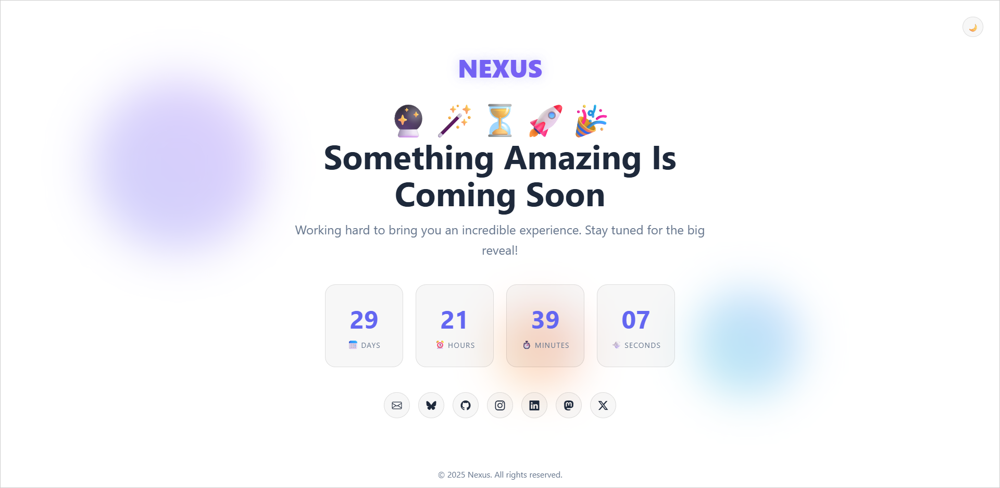
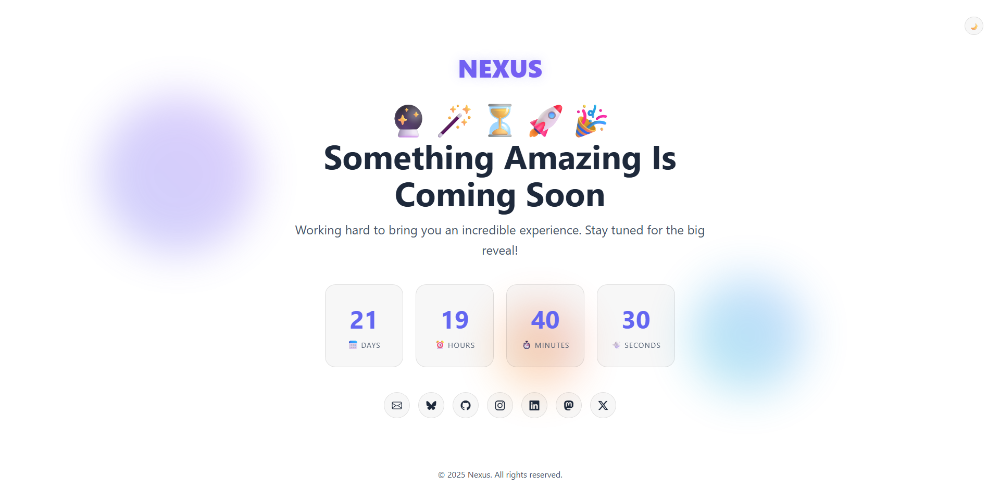
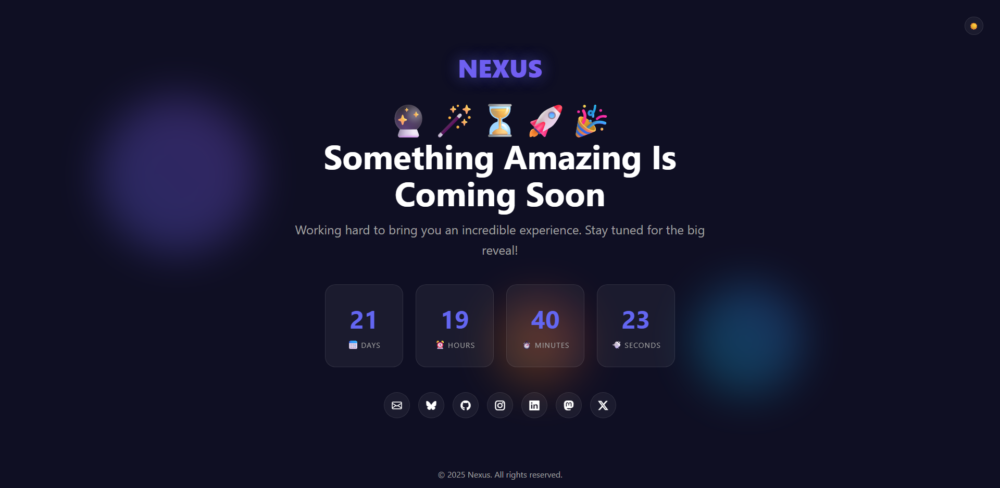
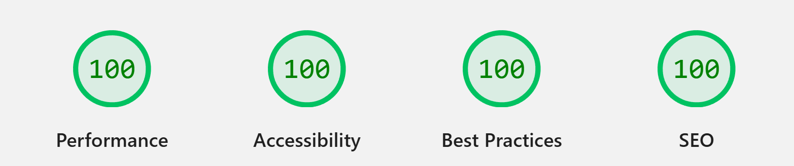
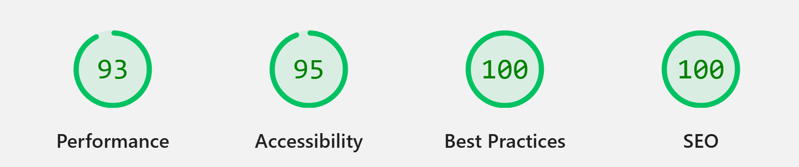
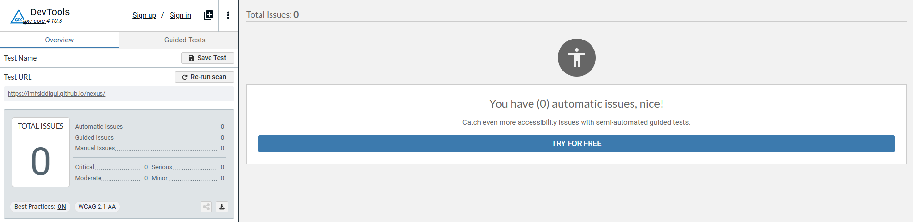
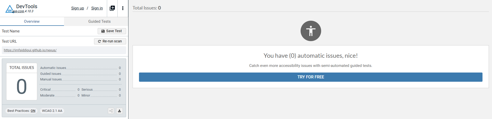

<!-- markdownlint-disable MD024 MD033 MD041 -->

<a id="top"></a>

<div align=center>

🌍 **[Web Page](https://imfsiddiqui.github.io/nexus)** | 💻
**[Source Code](https://github.com/imfsiddiqui/nexus)** | 🚀
**[Releases](https://github.com/imfsiddiqui/nexus/releases)**

</div>

# 🚀 nexus

A clean, responsive "Coming Soon" webpage template, perfect for announcing
upcoming projects or products.

<div align="center">
  
</div>

## 📚 Table of Contents

- [🚀 nexus](#-nexus)
  - [📚 Table of Contents](#-table-of-contents)
  - [📌 About](#-about)
  - [🧠 Philosophy](#-philosophy)
  - [🔑 Key Features](#-key-features)
  - [🛠️ Technologies Used](#️-technologies-used)
  - [🖼️ Screenshots](#️-screenshots)
    - [☀️ Light Mode](#️-light-mode)
    - [🌙 Dark Mode](#-dark-mode)
  - [👀 Performance and Accessibility Reports](#-performance-and-accessibility-reports)
    - [💻 Google Lighthouse: Desktop](#-google-lighthouse-desktop)
    - [📱 Google Lighthouse: Mobile](#-google-lighthouse-mobile)
    - [☀️ axe DevTools: Light Mode](#️-axe-devtools-light-mode)
    - [🌙 axe DevTools: Dark Mode](#-axe-devtools-dark-mode)
  - [📝 How to Use](#-how-to-use)
  - [📄 Important Documents](#-important-documents)
  - [📜 License](#-license)

<p align="right"><a href="#top">☝️</a></p>

## 📌 About

nexus is a clean, responsive "Coming Soon" webpage template designed to announce
upcoming projects or products. It features a modern design, easy customization,
and is built with HTML, CSS, and JavaScript. The template is fully responsive,
ensuring a great user experience on all devices. It is perfect for startups,
product launches, or any project that needs a stylish landing page before its
official release.

<p align="right"><a href="#top">☝️</a></p>

## 🧠 Philosophy

nexus is designed with simplicity and elegance in mind. The goal is to provide a
template that is not only visually appealing but also easy to use and customize.
The template follows best practices in web design, ensuring fast loading times,
cross-browser compatibility, and accessibility.

<p align="right"><a href="#top">☝️</a></p>

## 🔑 Key Features

- **Modern Aesthetics**: Clean and professional design that enhances user
  engagement.
- **Responsive Design**: Looks great on all devices, from desktops to
  smartphones.
- **Light and Dark Mode**: Supports both light and dark themes for user
  preference.
- **SEO Friendly**: Optimized for search engines to help your project get
  noticed.
- **Cross-Browser Compatibility**: Works seamlessly across all major browsers.
- **Lightweight**: Minimal dependencies for faster loading times.
- **Accessible**: Follows web accessibility standards to ensure all users can
  navigate and interact with the page.
- **Open Source**: Free to use, modify, and distribute under the MIT License.
- **Easy Customization**: Modify content with minimal effort.

<p align="right"><a href="#top">☝️</a></p>

## 🛠️ Technologies Used

- **HTML5**: Semantic, accessible markup.
- **CSS3**: Modern styling with responsive layouts and animations.
- **JavaScript (ES6 Modules)**: Modular scripts for UI, countdown, and theme.
- **Bootstrap Icons**: Lightweight, scalable icons for UI elements.
- **Meta Tags**: Open Graph and Twitter Card for social sharing.
- **Accessibility**: ARIA labels, roles, and keyboard navigation.
- **No Build Tools**: Easy to deploy and customize with pure HTML, CSS, and JS.

<p align="right"><a href="#top">☝️</a></p>

## 🖼️ Screenshots

### ☀️ Light Mode

<div align="center">
<figure>
  
  <figcaption>
    Screenshot Light Mode
  </figcaption>
</figure>
</div>

### 🌙 Dark Mode

<div align="center">
<figure>
  
  <figcaption>
    Screenshot Dark Mode
  </figcaption>
</figure>
</div>

<p align="right"><a href="#top">☝️</a></p>

## 👀 Performance and Accessibility Reports

### 💻 Google Lighthouse: Desktop

<div align="center">
<figure>
  
  <figcaption>
    Report Lighthouse Desktop
  </figcaption>
</figure>
</div>

### 📱 Google Lighthouse: Mobile

<div align="center">
<figure>
  
  <figcaption>
    Report Lighthouse Mobile
  </figcaption>
</figure>
</div>

### ☀️ axe DevTools: Light Mode

<div align="center">
<figure>
  
  <figcaption>
    Report Axe DevTools Light Mode
  </figcaption>
</figure>
</div>

### 🌙 axe DevTools: Dark Mode

<div align="center">
<figure>
  
  <figcaption>
    Report Axe DevTools Dark Mode
  </figcaption>
</figure>
</div>

<p align="right"><a href="#top">☝️</a></p>

## 📝 How to Use

To use this template for your own project:

- **Clone or Download**:
  [Clone the repository](https://github.com/imfsiddiqui/nexus) or
  [download the ZIP](https://github.com/imfsiddiqui/nexus/archive/refs/heads/main.zip).
- **Open the Project**: Open the project folder in your preferred code editor.
- **Customize Content**:
  - Edit `src/index.html` to update the title, description, logo, and social
    links.
  - Replace images in `src/assets/images/` as needed.
  - The countdown timer is set to 30 days by default. To change this, update
    `DEFAULT_DAYS_FROM_NOW` in `src/assets/js/countdown.js`.
- **Preview Locally**: Go to the `src/` directory from your terminal and run a
  local server to preview the page. You can use tools like:

  - **Node.js**:

    ```console
    npx http-server -p 5000
    ```

  - **Python**:

    ```console
    python -m http.server 5000
    ```

  Visit `http://localhost:5000` in your browser to see the page.

- **Deploy**: Upload the contents of the `src/` directory to your web server or
  static hosting (e.g., GitHub Pages, Netlify, Vercel).

<p align="right"><a href="#top">☝️</a></p>

## 📄 Important Documents

- [Changelog](https://github.com/imfsiddiqui/nexus/blob/main/docs/CHANGELOG.md):
  Changelog of all notable changes.
- [Code of Conduct](https://github.com/imfsiddiqui/nexus/blob/main/docs/CODE-OF-CONDUCT.md):
  Code of Conduct for contributors.
- [Commit Message Instructions](https://github.com/imfsiddiqui/nexus/blob/main/.github/copilot/commit-message-instructions.md):
  Commit message guidelines for contributors and Copilot.
- [Contribution Guidelines](https://github.com/imfsiddiqui/nexus/blob/main/docs/CONTRIBUTING.md):
  How to contribute to this project.
- [License](https://github.com/imfsiddiqui/nexus/blob/main/LICENSE.md): License
  text.
- [Pull Request Description Instructions](https://github.com/imfsiddiqui/nexus/blob/main/.github/copilot/pull-request-description-instructions.md):
  Pull request guidelines for contributors and Copilot.
- [Roadmap](https://github.com/imfsiddiqui/nexus/blob/main/docs/ROADMAP.md):
  High-level strategic plan, long-term goals, milestones, and overall project
  vision.
- [Security Policy](https://github.com/imfsiddiqui/nexus/blob/main/docs/SECURITY.md):
  Security policy and reporting instructions.
- [Todo](https://github.com/imfsiddiqui/nexus/blob/main/docs/TODO.md):
  Day-to-day task tracking and immediate execution.

<p align="right"><a href="#top">☝️</a></p>

## 📜 License

This project is licensed under the
[MIT License](https://github.com/imfsiddiqui/nexus/blob/main/LICENSE.md),
allowing anyone to use, modify, and distribute it freely for personal or
commercial purposes.

<p align="right"><a href="#top">☝️</a></p>
