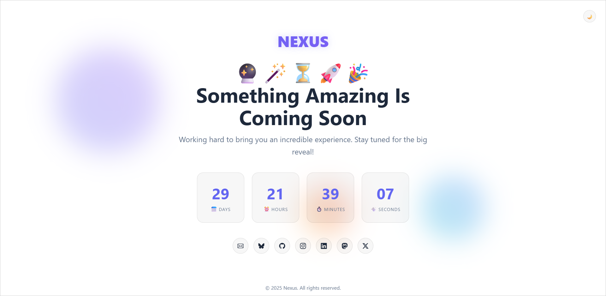

<!-- markdownlint-disable MD024 MD033 MD041 -->

  🌍 <strong><a href="https://imfsiddiqui.github.io/{{ site.repository_name }}">Web Page</a></strong>
  |
  💻 <strong><a href="https://github.com/imfsiddiqui/{{ site.repository_name }}">Source Code</a></strong>
  |
  🚀 <strong><a href="https://github.com/imfsiddiqui/{{ site.repository_name }}/releases">Releases</a></strong>

# 🚀 nexus

A clean, responsive "Coming Soon" webpage template, perfect for announcing
upcoming projects or products.

  

## 📚 Table of Contents

- [🚀 nexus](#-nexus)
  - [📚 Table of Contents](#-table-of-contents)
  - [📌 About](#-about)

<a href="#top">☝️</a>

## 📌 About

<!-- TODO: Add a detailed about here. -->

<a href="#top">☝️</a>

